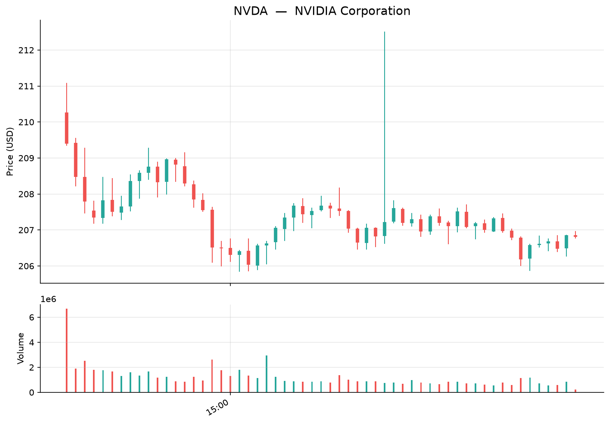
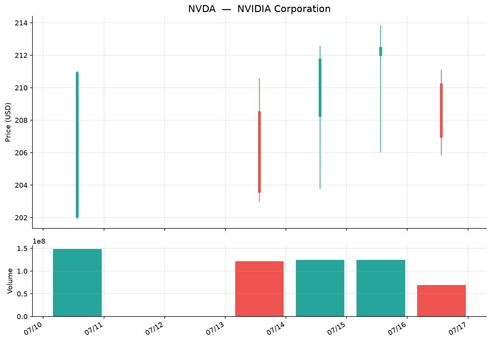
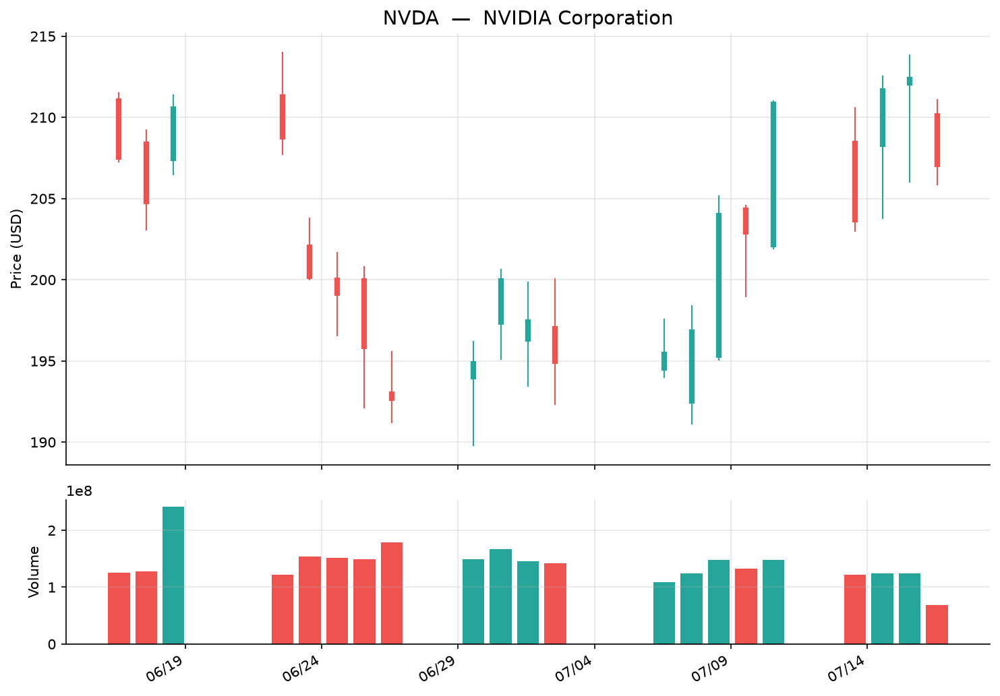
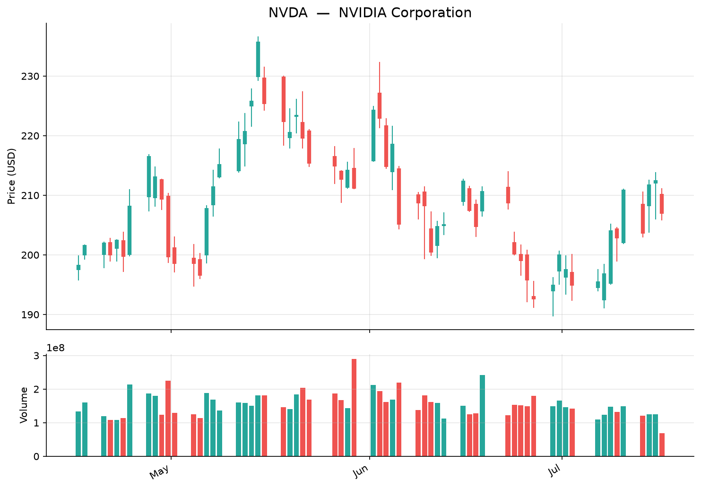
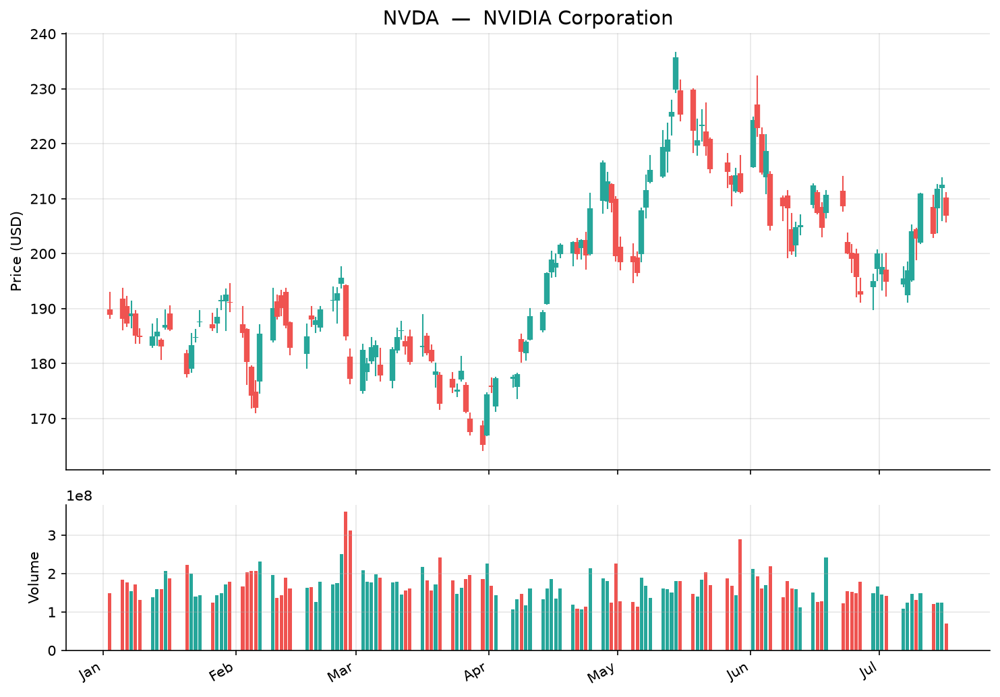
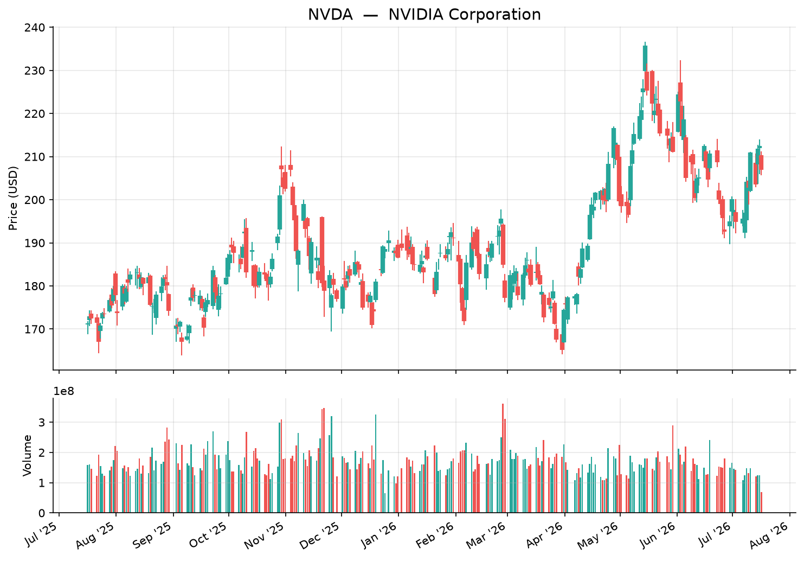
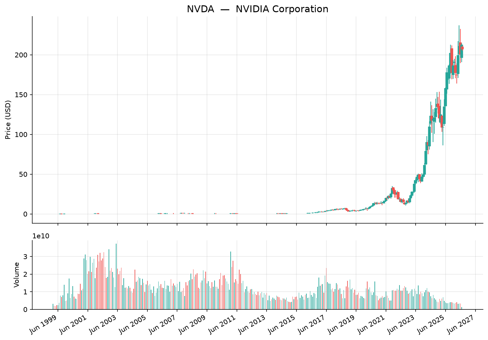

# stock-price

A lightweight Python CLI for fetching historical stock prices, volume, and OHLCV data from Yahoo Finance. Supports intraday ticks, daily/weekly/monthly bars, JSON export, and candlestick chart generation with smart x-axis labels.

## Features

- **No API key required** — uses Yahoo Finance public endpoints
- **Intraday support** — 1m, 5m, 15m, 30m, 1h intervals
- **Daily/weekly/monthly** — 1d, 5d, 1mo, 3mo, 6mo, 1y, 2y, 5y, 10y, ytd, max
- **Volume data** — volume stats in table output and dual-panel charts
- **Smart x-axis labels** — HH:MM for intraday, MM/DD for short-term, month names for medium-term, Mon YYYY for long-term
- **Candlestick charts** — with volume bars and adaptive bar widths
- **JSON export** — for downstream processing
- **Handles single-bar periods** — shows period change vs previous close from metadata

## Requirements

- Python 3.8+
- `matplotlib` (optional, for chart generation)

## Installation

```bash
git clone https://github.com/SohrabZ/stock-price.git
cd stock-price
python3 stock.py --help
```

## Usage

### Basic — table output
```bash
python3 stock.py NVDA
python3 stock.py AAPL --period 5d --interval 1d
python3 stock.py TSLA --period 1mo --interval 1d
```

### JSON export
```bash
python3 stock.py NVDA --json
python3 stock.py AAPL --period 1y --interval 1d --json > aapl.json
```

### Chart generation
```bash
python3 stock.py NVDA --graph
python3 stock.py NVDA --period 5d --interval 1d --graph --graph-output nvda_5d.png
```

### Multiple tickers
```bash
python3 stock.py AAPL TSLA NVDA
```

## Screenshots

### 1-Day Intraday (5m intervals) — HH:MM x-axis labels



### 1-Week Daily — MM/DD x-axis labels



### 1-Month Daily — MM/DD x-axis labels



### 3-Month Daily — Month name x-axis labels



### YTD Daily — Month name x-axis labels



### 1-Year Daily — Mon 'YY x-axis labels



### Max (All-Time Weekly) — Mon YYYY x-axis labels



## Smart X-Axis Labels

The chart automatically selects appropriate x-axis labels based on the actual time span of the data:

| Time Span | Format | Example |
|-----------|--------|---------|
| Intraday (<=1 day) | HH:MM | 09:30, 12:00 |
| Short-term (<=31 days) | MM/DD | 07/01, 07/15 |
| Medium-term (<=6 months) | Mon | Apr, May, Jun |
| ~1 year | Mon 'YY | Jul '25, Aug '25 |
| 1-2 years | Mon 'YY every 2mo | Jul '25, Sep '25 |
| 2-5 years | Mon 'YY every 3mo | Jul '25, Oct '25 |
| 5+ years | Mon YYYY every 1-2yr | Jun 1999, Jun 2001 |

## Period/Interval Matrix

| Period | Valid Intervals | Bars (typical) |
|--------|-----------------|----------------|
| 1d | 1m, 5m, 15m, 30m, 1h | 391 (1m), 78 (5m) |
| 5d | 5m, 15m, 30m, 1h, 1d | 5 (1d) |
| 1mo | 30m, 1h, 1d | ~22 (1d) |
| 3mo, 6mo | 1d, 1wk | ~66, ~132 (1d) |
| 1y, 2y, 5y, 10y | 1d, 1wk, 1mo | ~252, ~504 (1d) |
| ytd, max | 1d, 1wk, 1mo | varies |

## Programmatic Use

```python
from stock import fetch_stock_data, generate_graph

# Fetch data
meta, bars = fetch_stock_data("NVDA", period="5d", interval="1d")

# Generate chart with smart x-axis labels
generate_graph("NVDA", meta, bars, period="5d", output_path="nvda_chart.png")
```

## Notes

- **macOS SSL**: Uses `ssl._create_unverified_context()` to work around macOS certificate verification
- **Yahoo v8 API**: Requires `User-Agent: Mozilla/5.0` header
- **Single-bar periods** (1d): Period change calculated against `chartPreviousClose` from metadata
- **Opening auction**: Intraday charts detect and annotate the opening auction volume spike if it dwarfs regular trading
- **Adaptive bar widths**: Volume bars scale proportionally to the actual time interval between data points

## License

MIT
